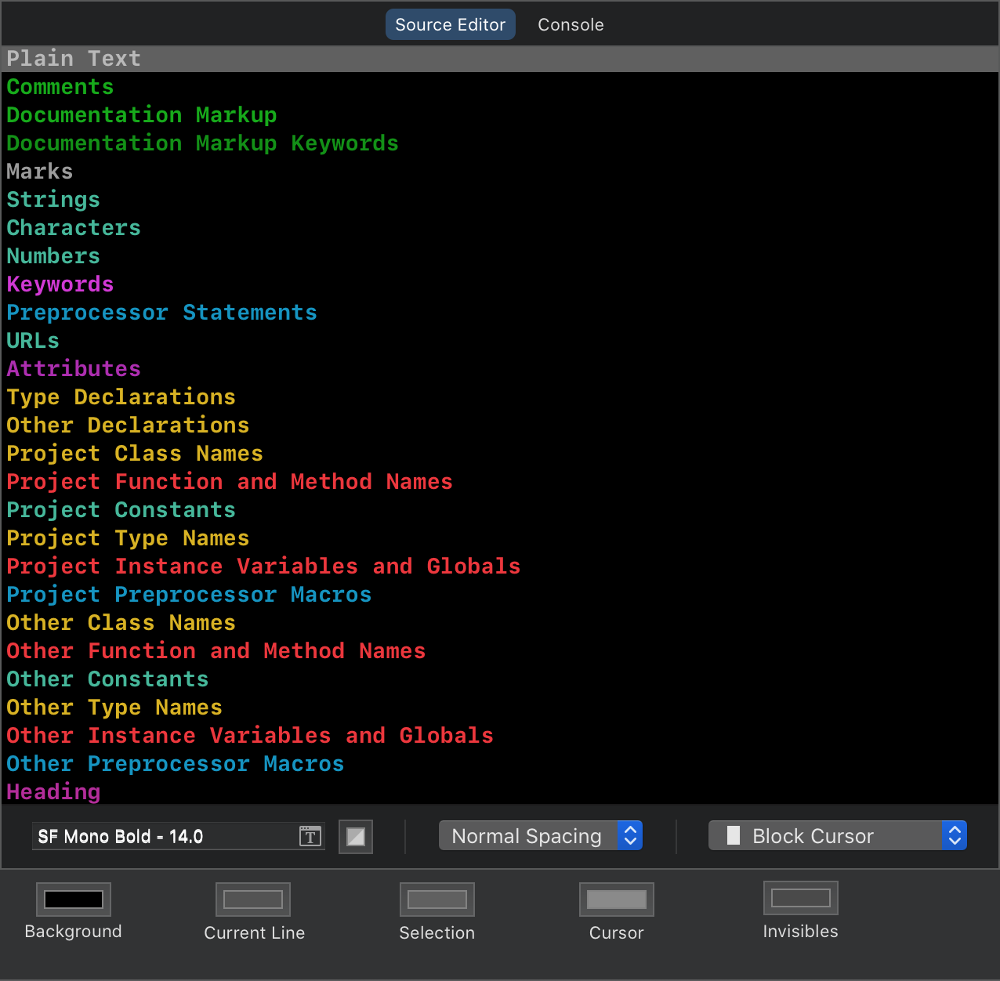
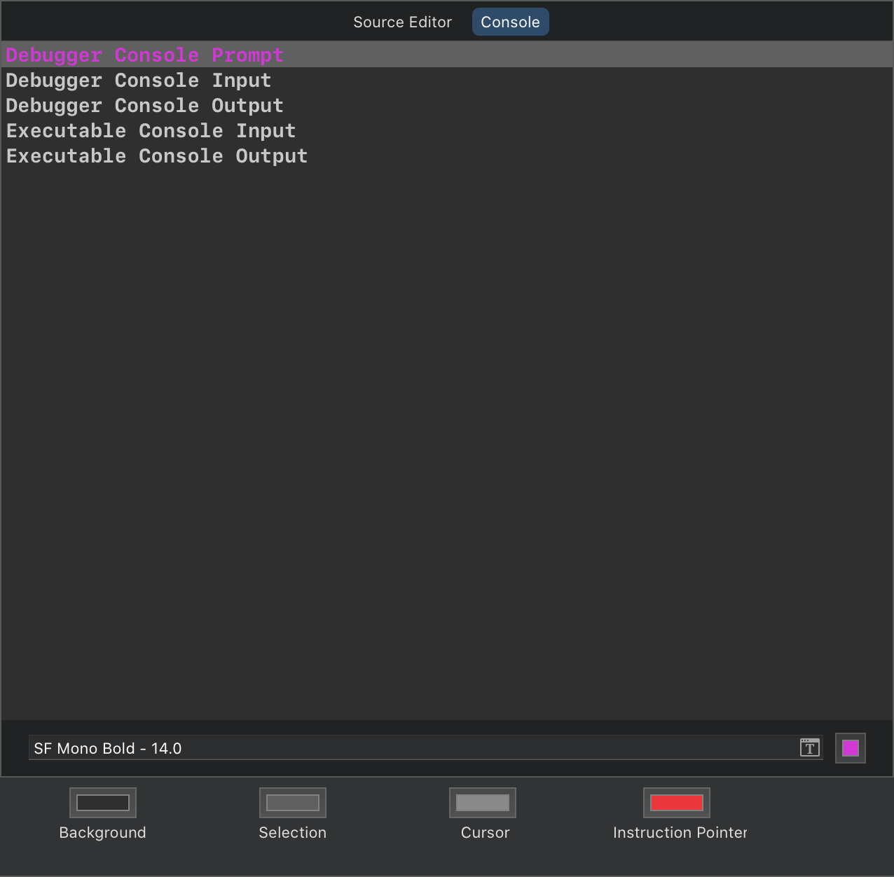
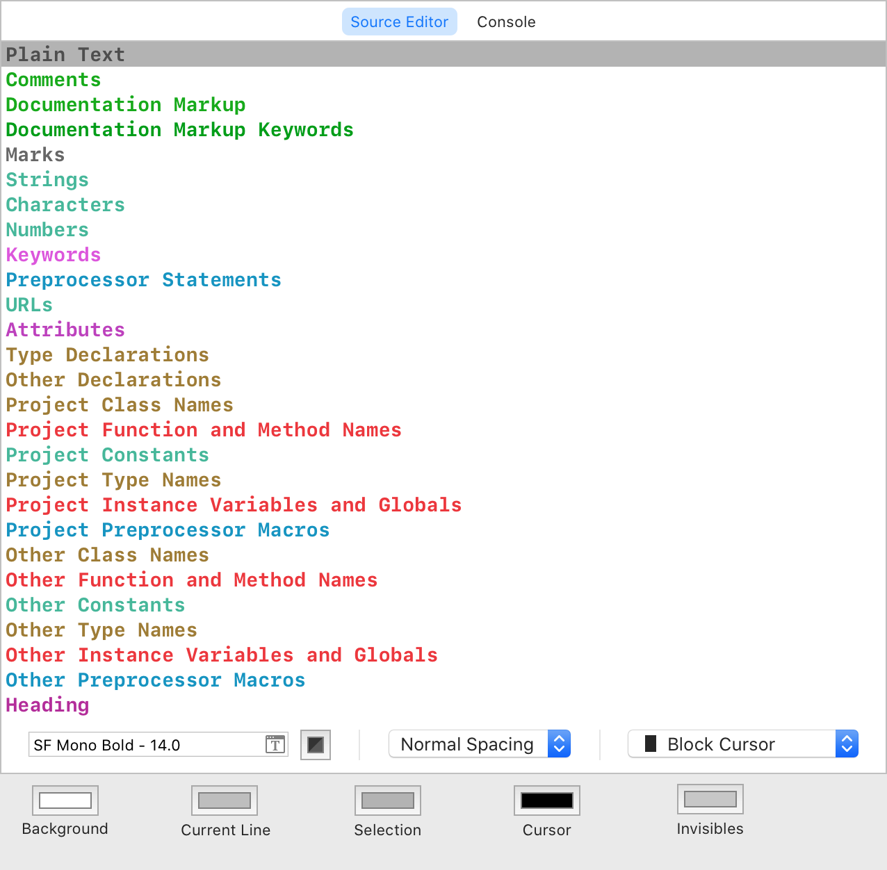
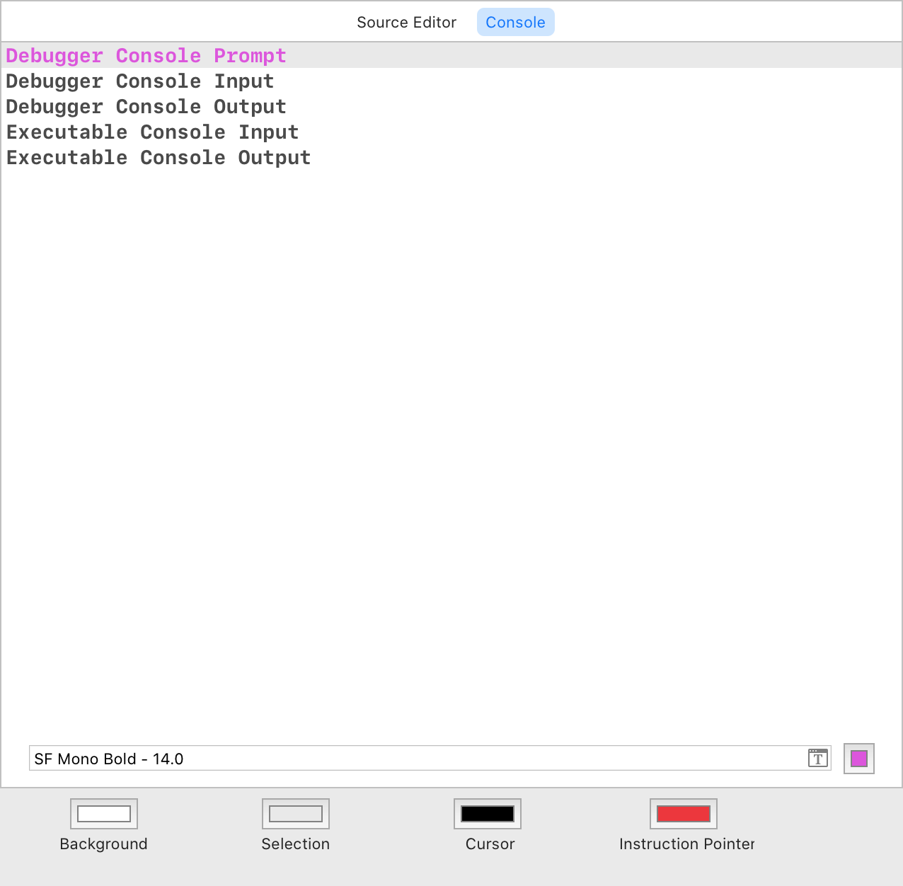

# Xcore is a theme for Xcode

The Dark and Light versions are designed to work together, so no matter what time of day it is; you'll always see the same familiar interface smiling back at you as you code.

